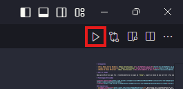

# Sobre o código - Precificador NFE

Uma aplicação básica com o intuito de receber valores de uma NFE (Nota Fiscal Eletrônica) por meio de um JSON e futuramente por outros meios. Com os valores recebidos é retornado o Custo Líquido de cada item.

# Tecnologias Utilizadas

[](https://code.visualstudio.com/docs)
[](https://docs.python.org/pt-br/3/)

### Dependências:
- **[openpyxl](https://openpyxl.readthedocs.io/en/stable/)**: Biblioteca para salvar os dados em uma planilha do Excel.

# Como Utilizar

#### No terminal e no diretório de sua escolha, de o seguinte comando:
```
git clone https://github.com/EricBrida/Precificador_NFE.git
cd Precificador_NFE
```

#### Após a clonagem do repositório, é uma boa índole criar um ambiente virtual para a instalação das dependências:

> [!NOTE]
> ***.venv** ou **.env** são opções viáveis para o nome de seu ambiente virtual.* </br>
> *Você pode selecionar o ambiente virtual pelo atalho **CTRL + SHIFT + P**, procurar por **"Python: Select Interpreter"** e buscar pelo .exe do venv.* </br>
> *O comando "pip install -r requirements.txt" fará a instalação de todas as dependências utilizadas no projeto.*

```
python -m venv <nome_ambiente_virtual>
<nome_ambiente_virtual>\Scripts\activate
pip install -r requirements.txt
```

> [!IMPORTANT]
> *Para rodar a aplicação é necessário que você insira os dados no arquivo **"valores_nfe.json"** e executar diretamente pelo arquivo **"precificar.py"**.*

#### Caso execute pelo terminal: 
```
python precificar.py
```

#### Caso tenha as extensões do Python baixada em seu VSCode:
<div>
    
</div>
 
### E-mail para contato: 
- **Eric Bueno Corrêa Brida** | *E-mail: [ericbrida.contato@gmail.com](mailto:ericbrida.contato@gmail.com)*
