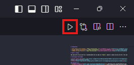

# Sobre o código - Precificador NFE

O desenvolvimento desta aplicação surgiu da necessidade de **solucionar um problema rotineiro** na empresa: calcular de maneira rápida, prática e padronizada o custo líquido dos produtos adquiridos por meio de notas fiscais de entrada.

Anteriormente, esse processo exigia a consulta manual aos valores presentes nas notas fiscais e a realização de cálculos individuais para cada produto, tornando a atividade repetitiva, demorada e sujeita a erros.

Para otimizar esse procedimento, foi desenvolvida uma aplicação básica em Python, utilizando a biblioteca Tkinter para a interface gráfica e ElementTree para a leitura dos arquivos XML das Notas Fiscais Eletrônicas (NF-e).

A aplicação permite que o usuário selecione um arquivo XML de uma NF-e diretamente pelo computador. A partir desse arquivo, o sistema extrai automaticamente as informações necessárias, como:

- Código e descrição do produto;
- Quantidade adquirida
- Preço unitário e valor total;
- Alíquotas e valores de ICMS;
- Alíquotas e valores de IPI;
- Informações tributárias necessárias ao cálculo do custo.

Com base nos dados extraídos e nas regras de cálculo estabelecidas pela empresa, a aplicação realiza o processamento dos valores e retorna o custo líquido de cada item, considerando os impostos e créditos tributários aplicáveis.

## Benefícios

A aplicação tem como principais objetivos:

- **Automatizar** a leitura das informações fiscais;
- **Reduzir** erros provenientes de cálculos manuais;
- **Economizar** tempo no processamento das notas fiscais;
- **Padronizar** o cálculo do custo dos produtos;
- **Facilitar** a análise de custos e **apoiar** as decisões de precificação e compra.

# Tecnologias Utilizadas

[](https://code.visualstudio.com/docs)
[](https://docs.python.org/pt-br/3/)

### Dependências:
- **[et_xmlfile](https://et-xmlfile.readthedocs.io/en/latest/)**: Dependência para realizar a leitura de um arquivo XML
- **[openpyxl](https://openpyxl.readthedocs.io/en/stable/)**: Dependência para salvar os dados em uma planilha do Excel (Em Desenvolvimento).

> [!NOTE]
> ***Função** para salvar em excel ainda não está disponível,* </br>
> *mas será adicionada em breve*

# Como Utilizar

#### No terminal e no diretório de sua escolha, de o seguinte comando:
```
git clone https://github.com/EricBrida/Precificador_NFE.git
cd Precificador_NFE
```

#### Após a clonagem do repositório, é uma boa índole criar um ambiente virtual para a instalação das dependências:

> [!NOTE]
> ***.venv** ou **.env** são opções viáveis para o nome de seu ambiente virtual.* </br>
> *Você pode selecionar o ambiente virtual pelo atalho **CTRL + SHIFT + P**, procurar por **"Python: Select Interpreter"** e buscar pelo .exe do venv.* </br>
> *O comando "pip install -r requirements.txt" fará a instalação de todas as dependências utilizadas no projeto.*

```
python -m venv <nome_ambiente_virtual>
<nome_ambiente_virtual>\Scripts\activate
pip install -r requirements.txt
```

> [!IMPORTANT]
> *Para rodar a aplicação é necessário que você insira os dados no arquivo **"valores_nfe.json"** e executar diretamente pelo arquivo **"precificar.py"**.*

#### Caso execute pelo terminal: 
```
python precificar.py
```

#### Caso tenha as extensões do Python baixada em seu VSCode:
<div>
    
</div>
 
### E-mail para contato: 
- **Eric Bueno Corrêa Brida** | *E-mail: [ericbrida.contato@gmail.com](mailto:ericbrida.contato@gmail.com)*
